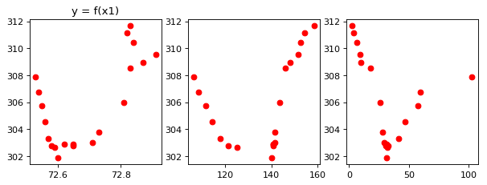

## Лабораторная работа №1

### Построение математических моделей эксперементально-статистическими методами (Метод наименьших квадратов)

#### Вариант 11
#### Работу выполнил: студент гр. 16-КМ-ПР-1 Токарев Владислав

### Импорт библиотек, настройка параметров, загрузка данных

Импортируем библиотеку numpy и загрузим из файла исходные данные


```python
import numpy as np # Импортируем пакет NumPy (Альтернатива Matlab)
import matplotlib as mpl # Импортируем пакет matplotlib для отрисовки графиков
import matplotlib.pyplot as plt 
from scipy.stats import fisher_exact
%matplotlib inline
# Настроим прочие параметры.
mpl.rcParams['savefig.dpi'] = 80
mpl.rcParams['figure.dpi'] = 80
np.set_printoptions(precision=4)
```

Загрузим данные для 11 варианта


```python
data = np.genfromtxt('/home/vlad/Documents/data-lab1.csv', delimiter=',')
```

Выведем загруженные данные. В первых трех колонках находятся значения переменных x1, x2, x3. 
Значение зависимой переменной y находятся в четвертой колонке


```python
print(data)
```

    [[  72.53  106.5   103.    307.88]
     [  72.54  108.43   59.4   306.77]
     [  72.55  111.5    57.7   305.75]
     [  72.56  114.28   46.5   304.55]
     [  72.57  117.97   41.1   303.33]
     [  72.58  121.42   32.7   302.75]
     [  72.59  125.28   31.8   302.64]
     [  72.6   140.17   31.5   301.88]
     [  72.62  140.84   31.1   302.86]
     [  72.65  140.62   30.9   302.78]
     [  72.71  141.51   29.13  302.99]
     [  72.73  141.55   28.13  303.77]
     [  72.65  140.62   30.9   302.9 ]
     [  72.81  143.36   26.02  305.97]
     [  72.83  146.06   17.79  308.55]
     [  72.87  148.17    9.46  308.96]
     [  72.91  151.51    8.88  309.53]
     [  72.84  152.4     6.46  310.4 ]
     [  72.82  154.35    4.02  311.17]
     [  72.83  158.28    2.54  311.66]]


Построим графики завимисоти y от x1, x2, x3. На графиках виден нелинейный характер зависимости, однако это не говорит об нелинйном характере зависимости y = f(x1,x2,x3)


```python
fig, axs = plt.subplots(nrows=1, ncols=3, figsize=(9,3))
axs[0].set_title("y = f(x1)")
axs[0].plot(data[:,0], data[:,3], 'ro')
axs[1].plot(data[:,1], data[:,3], 'ro')
axs[2].plot(data[:,2], data[:,3], 'ro')
```


    [<matplotlib.lines.Line2D at 0x7f146e8db2b0>]





### Построение модели

Дополним матрицу единичным вектором, для свободного члена уравнения


```python
ones = np.ones(20)
```


```python
data = np.insert(data, 3, ones, axis=1)
```

Получим коэффициенты модели линейной регрессии с помощью встроенной функции lstsq, функция lstsq использует метод наименьших квадратов для нахождения оптимальных коэффициентов


```python
x = data[:,0:4]
y = data[:,4]
```


```python
w = np.linalg.lstsq(x,y)[0]
w
```


    array([  3.4841e+01,  -1.0864e-01,   3.9499e-02,  -2.2132e+03])


Умножим матрицу независимых переменных на вектор коэффициентов. Получим спрогнозированный вектор значений искомой переменной y


```python
y_ = (w*x).sum(axis=1) # Предективный вектор значений
y_
```


    array([ 306.2459,  304.6625,  304.6102,  304.2142,  303.9484,  303.5903,
            303.4838,  302.2027,  302.8109,  303.8721,  305.796 ,  306.4489,
            303.8721,  308.9562,  309.0346,  309.87  ,  310.8779,  308.2467,
            307.2417,  307.1047])


### Проверка адекватности модели

#### Определим некоторые значения


```python
n = len(data) # Количество опытов
n
```


    20


```python
p = 3 # Количество факторов (x1, x2, x3)
```


```python
y_cp = y.sum() / n # Мат ожидание
```

#### Вычислим остаточную дисперсию S1


```python
f = n - p # Степени свободы
f
```


    17


```python
S1 = np.square(y - y_).sum() / f
S1
```


    4.7196974261579898


#### Вычислим дисперсию относительного среднего S2

Так как параллельные опыты отсутствуют, то будем использовать дисперсию относительного среднего


```python
f = n -1 # Степени свободы
f
```


    19


```python

S2 = np.square(y - y_cp).sum() / f
S2
```


    10.607668157894755


#### Вычислим коэффициент Фишера


```python
F = S2 / S1
F
```


    2.2475313987510837


Согласно таблице фишера табличный коэффициент для степеней свободы 19 и 17 с вероятностью ошибки 5% $F_{табл} = 2.23 \to$ точность модели порядка 95%

Итого, полученная модель:

$y = 34.84x_{1} - 0.11x_{2} + 0.04x_{3} - 2213,2$
